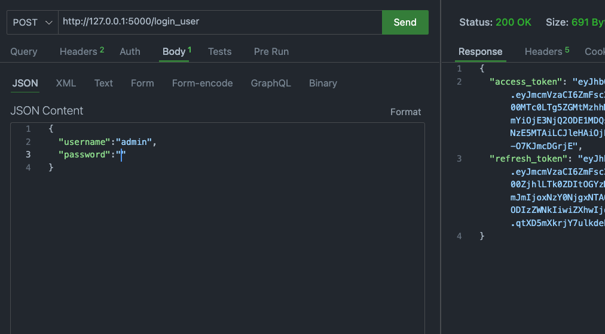
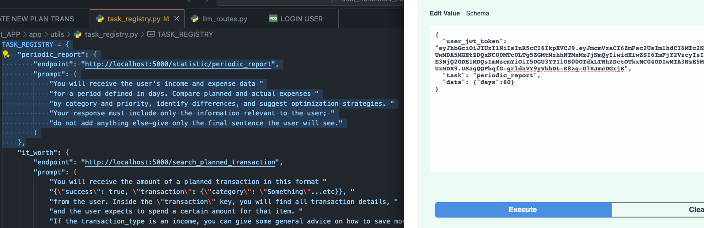
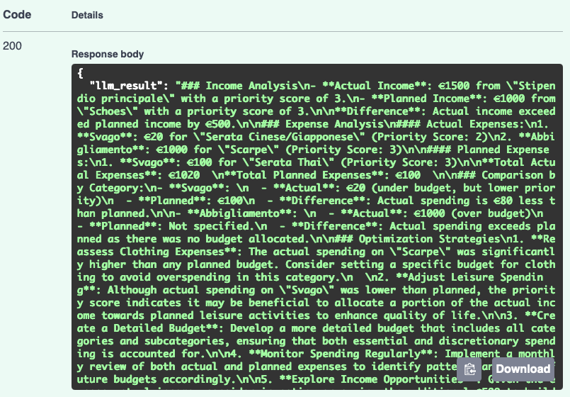

External AI Integration plus Economic Planner


⸻


<p align="center">
  <b>- External AI Integration plus Economic Planner -</b><br>
  Flask + FastAPI application demonstrating AI integration with an economic planning core.<br>
</p>


<p align="center">
  <a href="#-overview"> Overview</a> •
  <a href="#-features"> Features</a> •
  <a href="#-media"> Media</a> •
  <a href="#-setup"> Setup</a> •
  <a href="#-workflow"> Workflow Example</a> •
  <a href="#-license"> License</a>
</p>


⸻

- Overview

This application is divided in two sections with two frameworks which communicate with each other:

Economic Planner (Core Application)
This is a forward-looking financial planning app designed to help users manage and forecast their budget over a very flexible period of time. Unlike traditional budget apps that focus only on current balances and immediate expenses, this planner emphasizes planned vs actual transactions, allowing users to track predicted spending and income against real outcomes.

Key features:
	•	Planned Transactions: record intended expenses or income in advance.
	•	Actual Transactions: confirm what was really spent or earned.
	•	Is Completed Flag: tracks whether a planned transaction has been realized, ensuring accurate future forecasts.
	•	Recurring transactions: daily, weekly, monthly, or yearly, for precise future planning.

⸻

External AI Integration (FastAPI Module)
This project demonstrates how an external AI module can be integrated into an existing application without modifying its core logic, especially for frameworks that do not optimally support asynchronous operations required for AI, such as Flask. The AI component is hosted via FastAPI, providing asynchronous endpoints that can enhance the app with advanced features, such as data analysis or smart suggestions.

Highlights:
	•	Fully decoupled from the main Flask app, making it reusable for other projects.
	•	Enables AI-powered features even in apps built with frameworks that lack robust async support.
	•	Serves as a portfolio-ready example of extending existing software with AI services.

⸻

```text
       ┌─────────────┐
       │  Frontend   │
       │ (User Input)│
       └─────┬───────┘
             │ token + task
             ▼
   ┌──────────────────────┐
   │  FastAPI (AI Gateway)│
   │  - receives task     │
   │  - async processing  │
   └─────┬────────────────┘
         │ HTTP async request (token + prompt)
         ▼
   ┌──────────────────────────┐
   │  Flask App (Core Logic)  │
   │  - endpoint validation   │
   │  - generates JSON data   │
   └─────┬────────────────────┘
         │ JSON response
         ▼
   ┌──────────────────────┐
   │  FastAPI             │
   │  - process data      │
   │  - prepare for LLM   │
   └─────┬────────────────┘
         │ prompt + processed data
         ▼
       ┌───────────────┐
       │     LLM       │
       │  - generates  │
       │    final      │
       │   response    │
       └─────┬─────────┘
             │ final result
             ▼
       ┌─────────────┐
       │  Frontend   │
       │ (Display)   │
       └─────────────┘

Legend (summary)
	•	task → keyword + prompt for the LLM associated with an endpoint
	•	token → JWT used for security validation
	•	processed data → JSON processed and prepared for the LLM
	•	LLM → Large Language Model that generates the final response based on the prompt and data

⸻

- Features
	•	Forward-looking financial planning (planned vs actual transactions)
	•	Recurring transactions: daily, weekly, monthly, yearly
	•	External AI integration using FastAPI
	•	Asynchronous endpoints for AI processing
	•	Decoupled architecture (Flask + FastAPI)
	•	Portfolio-ready example of extending software with AI

⸻

- Media
	1.	

User login to obtain access token.

	2.	

Simulate saving a transaction with exaggerated cost.

	3.	

Frontend submits task to Flask endpoint.

	4.	

AI processes data and returns a detailed response.

Or go to ./media folder for all media files.

⸻

- Setup

1. Clone the Repository

            git clone https://github.com/your-username/ExternalAI.git
            cd ExternalAI

2. Start FastAPI (AI Gateway)

            cd FASTAPI_APP
            uvicorn run:app --reload

3. Start Flask App (Core Logic)

            cd FLASK_APP
            python3 run.py


⸻

- Workflow Example
	1.	Login
User logs in to obtain the access token for authentication in all subsequent requests.


	2.	Create a Transaction
Here we're creating an expensive transaction to test the LLM.


	3.	Submit Task
Here we're simulating the Frontend sends request to Flask endpoint specifying the task from the Task Registry. The Frontend and backend has to refer to the same TASK REGISTRY.


	4.	AI Reply
FastAPI processes the submitted data, interacts with the LLM, and generates the final response, it can be converted after in HTML.


⸻

- License

This project is open source and intended for learning and portfolio purposes.
Feel free to fork, modify, or expand this repository.

⸻

      • Author: Salvatore Lombardo
	•	Guitarist • Software Developer • Music Teacher • Artistic Director
	•	Based in Sicily, Italy
	•	Email: salvolombardoj@gmail.com
	•	Portfolio: https://github.com/SalvoLombardo

⸻


